# Release Flow

Основным артефактом каждого релиза является `wheel` - формат дистрибутива Python-пакета. Каждый пуш коммита в релизные ветки триггерит GitHub Actions workflow, который запускает semantic-release, выпускает новый релиз по правилам из таблицы [версионирования](#версионирование) и публикует его в PyPI и GitHub Releases. Коммиты с `[skip ci]` в конце workflow игнорирует - именно поэтому backmerge-коммиты не создают новых релизов и не имеют тегов на диаграммах.

Changelog генерируется автоматически при каждом релизном событии: alpha, rc, stable, hotfix, maintenance. Для сохранения корректной истории в changelog PR в prerelease-ветки (`feature/*`, `release/*`, `hotfix/*`) необходиме мерджить без squash.

Так же changelog конкретной версии попадает в release notes к этой версии. 

| Ветка                  | Тип релиза                   | PyPI канал                     |
| ---------------------- | -----------------------------| ------------------------------ |
| `feature/*`            | Dev build (artifact)         | не публикуется                 |
| `develop`              | Pre-release (alpha)          | `--pre`                        |
| `release/*`            | Pre-release (rc)             | `--pre`                        |
| `master`               | Stable release               | `latest`                       |
| `hotfix/*` -> `master` | Stable release (patch)       | только прямым указанием версии |
| `1.x`                  | Stable release (maintenance) | только прямым указанием версии |

## Общая диаграмма

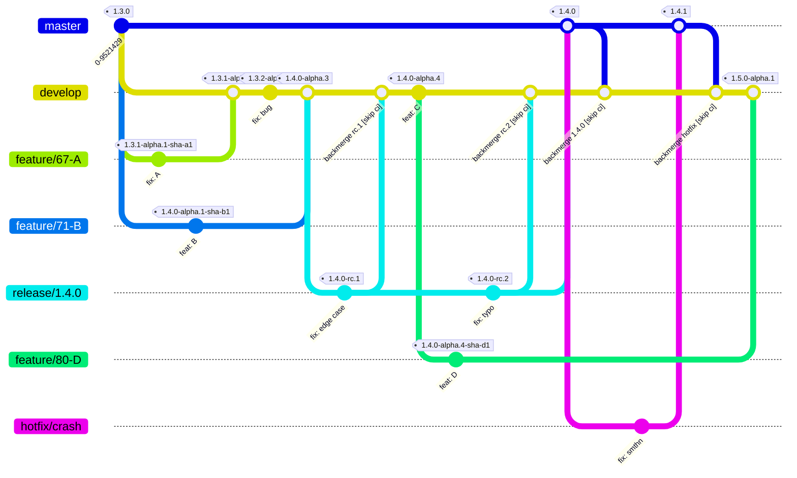
## Dev Release

### Feature Dev Builds

Ветка `feature/*` создаётся от `develop`. Каждый пуш в `feature/*` запускает CI, который собирает wheel и сохраняет его как артефакт сборки (GitHub Actions artifact). Эти сборки не публикуются в PyPI и в GitHub Releases - они доступны только внутри workflow как артефакты.

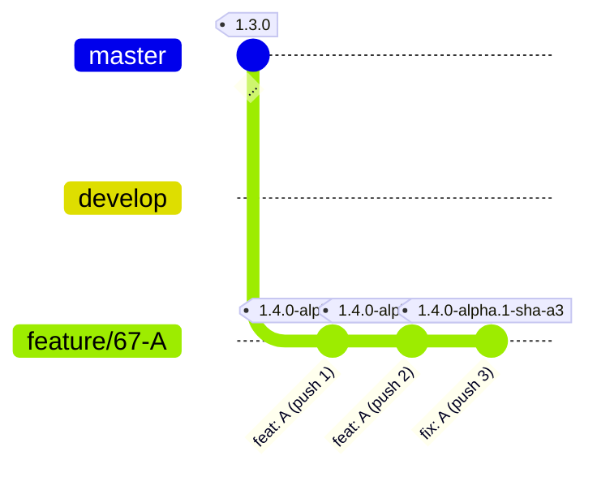

Если feature-ветка создаётся от коммита с уже существующим alpha-тегом, тег dev-сборки будет содержать эту же base-версию:

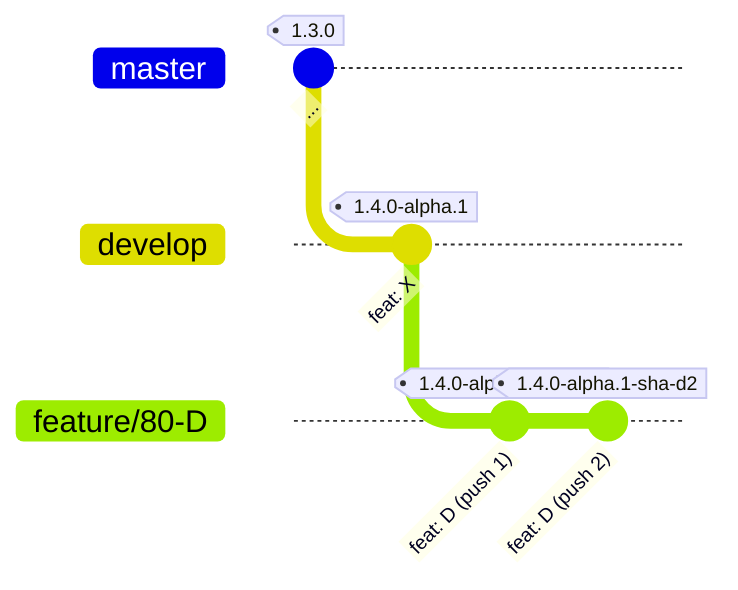

### Alpha Releases from develop

После мержа PR из `feature/*` в `develop` semantic-release автоматически публикует новый pre-release alpha.

Версия бампается один раз при первом коммите соответствующего типа, последующие коммиты того же типа только инкрементируют счётчик alpha:

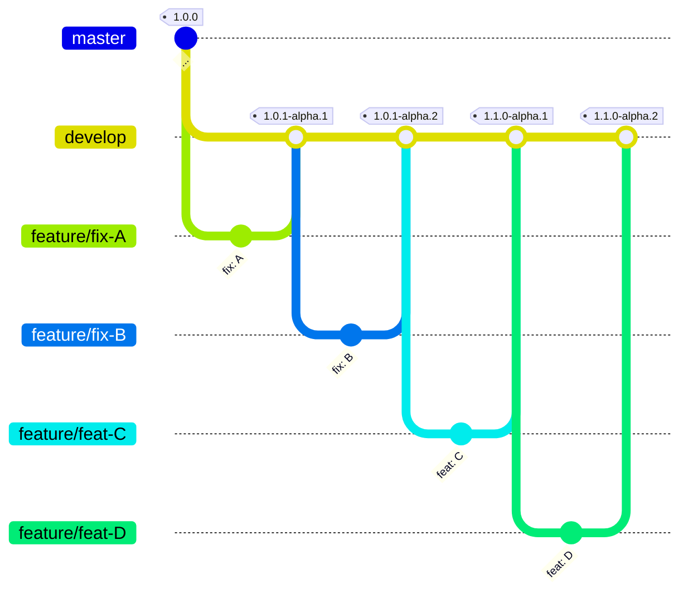

Параллельные feature-ветки не мешают друг другу - каждый пуш генерирует независимую dev-сборку со своим SHA. Счётчик alpha на `develop` инкрементируется при каждом пуше (если есть необходимый [коммит](#Версионирование)):

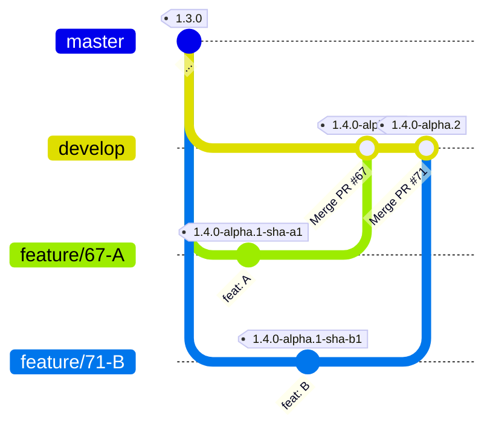
## Release Candidate

`release/1.4.0` создаётся от `develop`.

> На ветке `release/*` вручную допускаются только `fix:`-коммиты. Это соглашение на уровне команды - автоматической проверки в CI пока нет (backlog). Так же не допускается существование нескольких `release/*` веток одновременно.

Backmerge - это автоматический merge изменений (`CHANGELOG.md`, `pyproject.toml`) из релизной ветки обратно в `develop` после каждого релизного шага. Пушится коммит с `[skip ci]`, чтобы не триггерить новый alpha. Если при backmerge возникают конфликты - semantic-release создаёт PR для ручного разрешения конфликта.

### Кейс 1 - RC только с внутренними фиксами

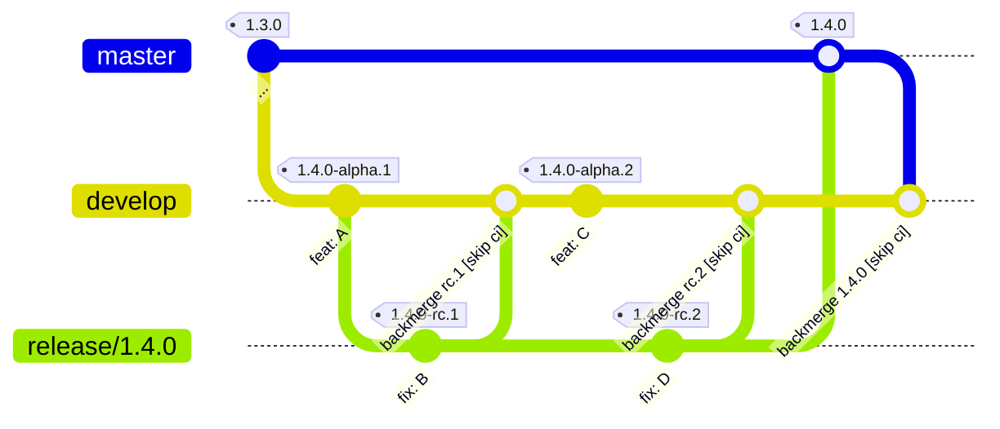

### Кейс 2 - RC с добавлением новых изменений с develop

Если в процессе RC нужно включить новые изменения из `develop` - ветка `release/*` ребейзится на `develop`.

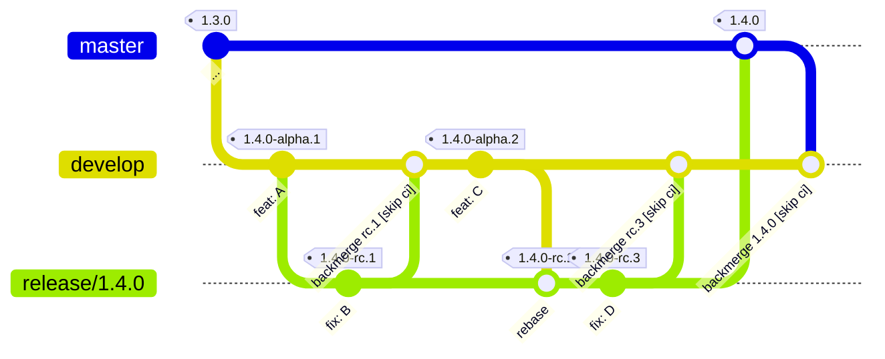

### Кейс 3 - Backmerge с конфликтом

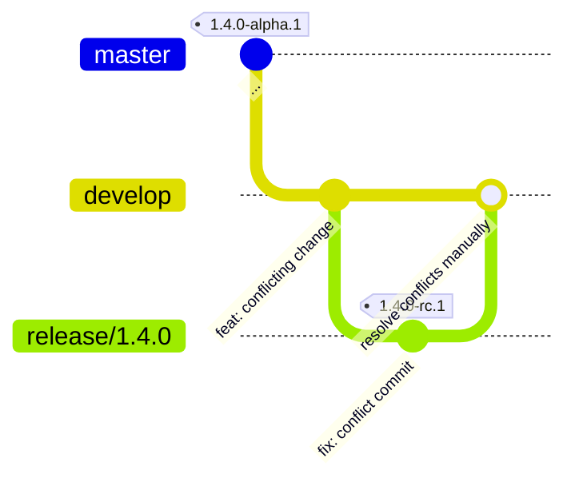

## Stable Release

`release/1.4.0` мержится в `master` через PR. semantic-release создаёт тег `v1.4.0` как stable. Backmerge доставляет в `develop` обновлённые `CHANGELOG.md` и `pyproject.toml` - новый alpha при этом не создаётся из-за тега `[skip ci]`. Так же создается PR если в backmerge из `master` в `develop` если возник конфликт.

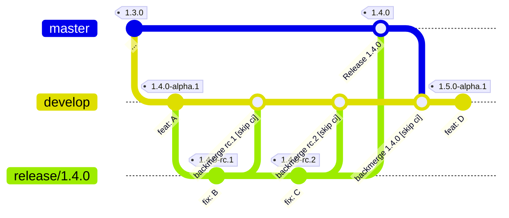
## Hotfix

Хотфикс используется для критических багов в stable-релизах. Ветка `hotfix/*` создаётся напрямую от `master`, минуя `develop` и `release/*`. После мержа в `master` semantic-release публикует stable патч-релиз делает backmerge в `develop`.

> На ветке `hotfix/*` вручную допускаются только `fix:`-коммиты. Это соглашение на уровне команды - автоматической проверки в CI пока нет (backlog).

### Кейс 1 - баг и в master, и в develop

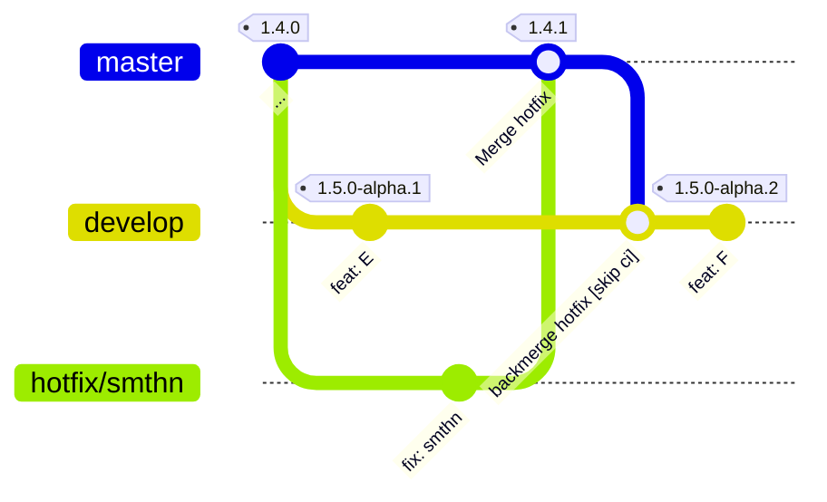

### Кейс 2 - баг в master, в develop уже пофикшен (конфликт в backmerge)

Если в `develop` баг уже исправлен иначе - backmerge создаёт конфликт. semantic-release открывает PR, который остаётся открытым для ручного разрешения конфликта.

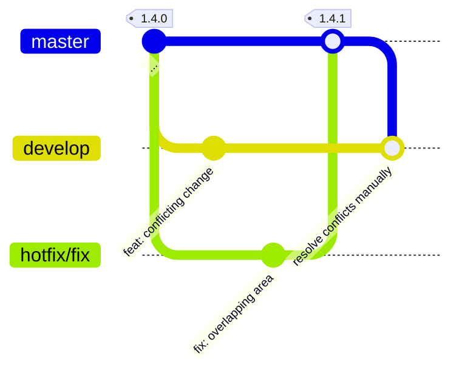
## Maintenance Release

Используется когда нужно патчить или добавлять фичи в старую мажорную версию, пока `master` уже ушёл вперёд. Maintenance-ветка не мержится обратно в `develop` или `master`. Все изменения вносятся через отдельные ветки + PR. semantic-release публикует maintenance релиз.

> Breaking changes в maintenance-ветках запрещены.

### Кейс 1 - fix и feat в старой мажорной версии

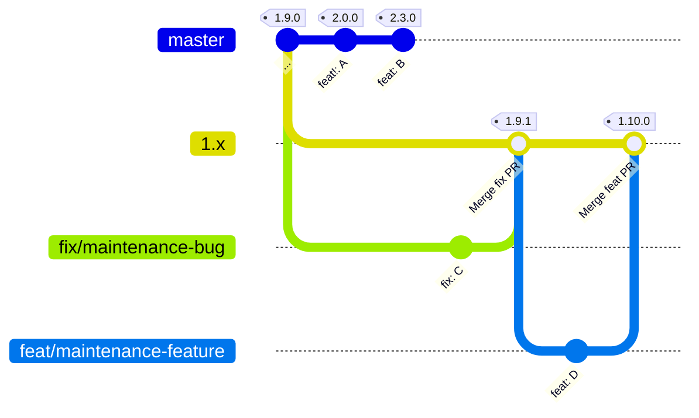

### Кейс 2 - баг и в master, и в 1.x

Фикс сначала выходит на `master`, затем добавляется в отдельную ветку и мержится в `1.x`.

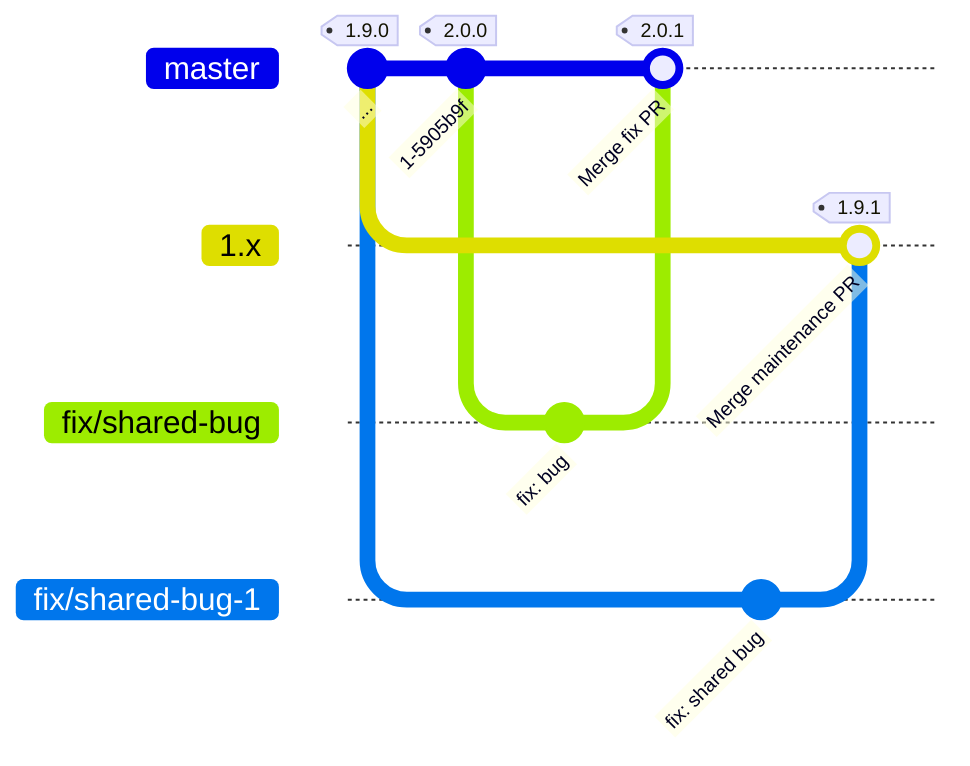

**Правила maintenance-веток:**
- Создаются только для мажорных версий: `1.x`, `2.x` и т.д.
- Ветка создаётся от последнего тега в этой мажорной линии (например от `v1.9.0`)
- Ветку нужно явно добавить в `branches` конфига `.releaserc`
- Допустимые коммиты: `fix:` и `feat:` (без breaking changes)
## Публикация пакета

| Тип релиза                           | GitHub Releases | PyPI          |
| ------------------------------------ | --------------- | ------------- |
| `1.4.0-alpha.1-sha-abc123` (feature) | -               | -             |
| `1.4.0-alpha.1` (develop)            | +               | + pre-release |
| `1.4.0-rc.1` (release/*)             | +               | + pre-release |
| `1.4.0` (master)                     | +               | + latest      |

## Версионирование

Только `feat`, `fix`, `docs` и `refactor` триггерят релиз. Все остальные коммиты (`chore`, `ci`, `style`, `test`, `build`, `config`) игнорируются semantic-release.

| Ветка       | Тип коммита                    | Bump        | Результат                 | Примечание                    |
| ----------- | ------------------------------ | ----------- | ------------------------- | ----------------------------- |
| `feature/*` | любой                          | sha         | `1.4.0-alpha.1-sha-<sha>` | artifact                      |
| `develop`   | `fix:` / `docs:` / `refactor:` | patch+alpha | `1.0.1-alpha.N`           | bump один раз, далее только N |
| `develop`   | `feat:`                        | minor+alpha | `1.1.0-alpha.N`           | bump один раз, далее только N |
| `release/*` | `fix:`                         | rc          | `1.4.0-rc.N`              | только fix:                   |
| `master`    | `fix:` / `docs:` / `refactor:` | patch       | `1.4.1`                   |                               |
| `master`    | `feat:`                        | minor       | `1.5.0`                   | включает все patch-изменения  |
| `master`    | `feat!:` / `BREAKING CHANGE`   | major       | `2.0.0`                   |                               |
| `1.x`       | `fix:`                         | patch       | `1.9.1`                   |                               |
| `1.x`       | `feat:`                        | minor       | `1.10.0`                  | без breaking changes          |

